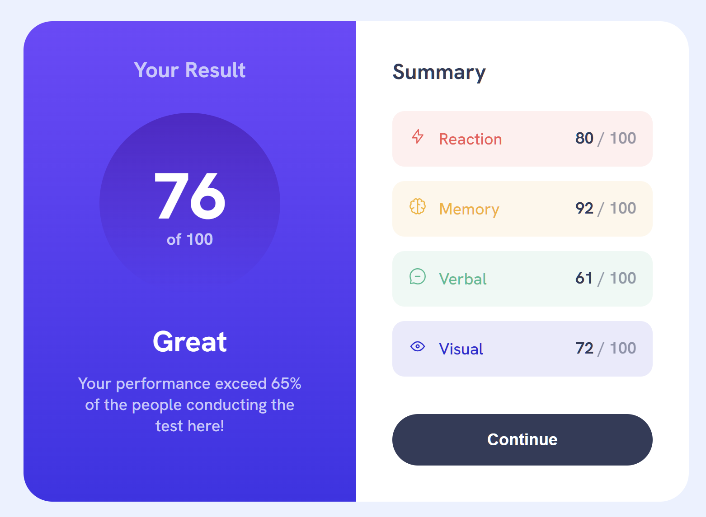

# Frontend Mentor - Results summary component solution

This is a solution to the [Results summary component challenge on Frontend Mentor](https://www.frontendmentor.io/challenges/results-summary-component-CE_K6s0maV). Frontend Mentor challenges help you improve your coding skills by building realistic projects. 

## Table of contents

- [Overview](#overview)
  - [The challenge](#the-challenge)
  - [Screenshot](#screenshot)
  - [Links](#links)
- [My process](#my-process)
  - [Built with](#built-with)
  - [What I learned](#what-i-learned)
- [Author](#author)

## Overview

### The challenge

Users should be able to:

- View the optimal layout for the interface depending on their device's screen size
- See hover and focus states for all interactive elements on the page
- Use the local JSON data to dynamically populate the content

### Screenshot

### Links

- [Solution URL](https://github.com/anton-zykov/fm-results-summary)
- [Live Site URL](https://anton-zykov.github.io/fm-results-summary/)

## My process

### Built with

- Semantic HTML5 markup
- CSS custom properties
- Mobile-first workflow
- Vanilla JS components populated with fetched data

### What I learned

This is the challenge I started a while ago, but it got deleted because I migrated to a new computer and had not saved my work. This time it took me a lot less time to complete the challenge, I was very confident with using all the technologies required.

## Author

- Frontend Mentor - [@anton-zykov](https://www.frontendmentor.io/profile/anton-zykov)
- LinkedIn - [anton-zykov-916a06248](https://www.linkedin.com/in/anton-zykov-916a06248/)
